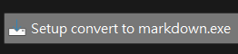
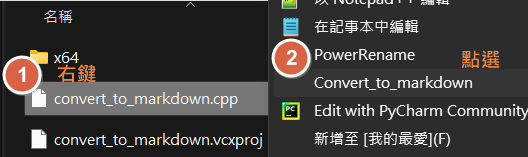
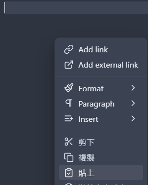
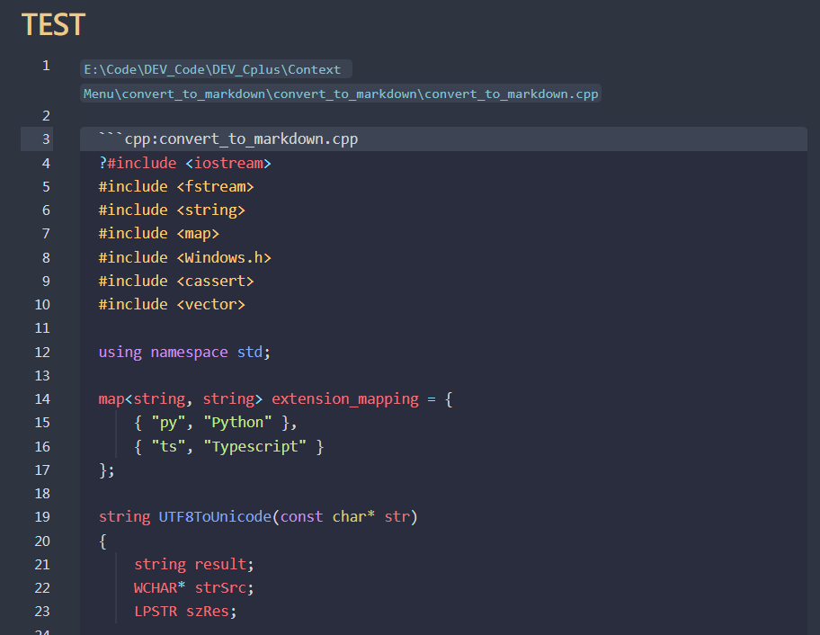
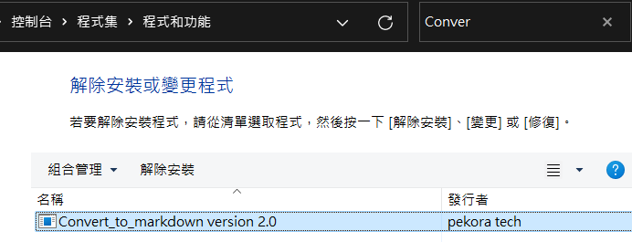

# Convert to Markdown 

## 簡介

「Convert to Markdown」是一個由C++在Visual Studio中開發的擴充功能，其主要目的是讓使用者能夠迅速複製程式碼並將其轉換成Markdown格式，以便更輕鬆地分享程式內容。使用者只需透過檔案右鍵選單，就能輕鬆完成轉換操作。選擇C++作為開發語言的原因是，經過測試後發現它在性能方面優勢明顯，相較於C#、Node.js或Python等其他語言，具有不可忽視的優勢。

## 特色

- **簡易安裝**：提供 `Setup convert to markdown.exe` 安裝檔，用戶可輕鬆安裝擴充功能。
- **右鍵選單整合**：安裝後，用戶在程式碼檔案上右鍵，選擇「轉換為 Markdown」即可。
- **剪貼簿便捷**：轉換後的 Markdown 內容，包括檔案名稱和程式碼，會自動暫存於剪貼簿中。

## 安裝指南

運行可執行檔案 `./Setup convert to markdown.exe` 進行安裝。安裝完成後，在程式碼檔案上右鍵即可看到轉換為 Markdown 的選項。

## 使用方法

- 在想要轉換的程式碼檔案上點擊右鍵。
- 從右鍵選單中選擇「Convert_To_Markdown」選項。
- 程式將立即處理內容，並將 Markdown 格式的文本複製到剪貼簿。
- 將 Markdown 內容粘貼到任何需要的位置。

右鍵點選功能

貼至目標位置

結果呈現

## 解除安裝

請至控制台進行解除安裝或變更程式。

## 技術實現

該工具採用 C++ 自定義的右鍵選單，並使用 Inno Setup，完成程式碼安裝與選單註冊。 製作安裝包，確保最終用戶能夠毫不費力地安裝工具。

## 貢獻

歡迎對工具進行改進或添加新功能的貢獻。請隨意分支存儲庫、進行更改並提交拉取請求。

## 授權

本專案採用 MIT 授權 - 詳情請見 LICENSE 檔案。
